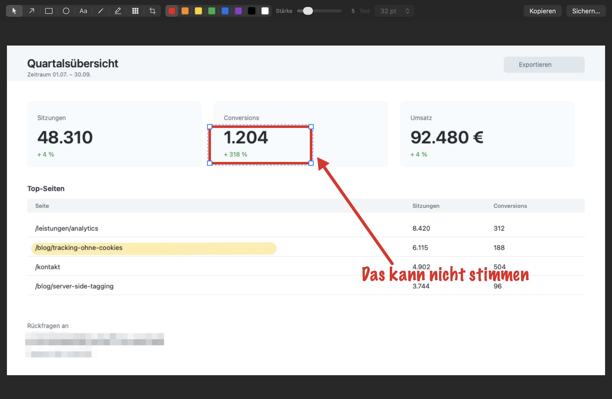

# Kritzel

Ein schlanker Skitch-Ersatz für macOS. Native App in Swift/AppKit, ohne
Abhängigkeiten, ohne Xcode-Projekt. Entstanden, weil Skitch auf kommenden
macOS-Versionen ausfällt und die Alternativen den häufigsten Fall verfehlen:
ein Bild aus einer anderen App kopieren und sofort annotieren, statt erst
einen Screenshot zu machen.

Läuft auf Macs mit Apple Silicon ab macOS 13.

*A lightweight Skitch replacement for macOS: paste an image from the clipboard,
annotate it with arrows, text, shapes, highlighter and pixelation, copy or save
it. Native Swift/AppKit, no dependencies, no Xcode project. Documentation is in
German.*



## Bauen und installieren

Gebraucht werden nur Apples Command Line Tools, kein Xcode:

```bash
xcode-select --install           # falls noch nicht vorhanden
git clone https://github.com/slarty667/kritzel.git
cd kritzel
./build.sh                       # baut Kritzel.app
cp -R Kritzel.app /Applications/
./run-tests.sh                   # Render- und Interaktionstests
```

Die App ist ad-hoc signiert und nicht bei Apple notarisiert. Selbst gebaut ist
das egal. Wer stattdessen ein fertiges `Kritzel.app` geschickt bekommt, muss
einmalig die Quarantäne-Markierung entfernen, sonst blockt Gatekeeper:

```bash
xattr -dr com.apple.quarantine /Applications/Kritzel.app
```

## Bedienung

Der Normalfall: irgendwo ein Bild kopieren, Kritzel aktivieren, es liegt schon
auf der Leinwand. Ist beim Start nichts in der Zwischenablage, kommt eine leere
weiße Fläche.

| Taste | Wirkung |
|---|---|
| `1`–`9` | Werkzeug wählen: Auswahl, Pfeil, Rechteck, Ellipse, Text, Stift, Marker, Verpixeln, Zuschneiden |
| `⌘V` | Bild aus der Zwischenablage in ein neues Fenster |
| `⌘⇧4` | Bildschirmausschnitt aufnehmen und öffnen |
| `⌘N` | leere Fläche |
| `⌘O` | Bilddatei öffnen (Drag & Drop ins Fenster geht auch) |
| `⌘S` oder `⌘E` | Sichern-Dialog (PNG oder JPEG) |
| `⌘C` | ausgewähltes Objekt kopieren, ohne Auswahl das ganze Bild |
| `⌘V` | kopiertes Objekt einfügen, sonst Bild aus der Zwischenablage |
| `⌘⇧C` | fertiges Bild in die Zwischenablage |
| `⌘Z` / `⌘⇧Z` | widerrufen / wiederholen |
| `⌫` | ausgewähltes Objekt löschen |
| Pfeiltasten | Auswahl um 1 px schieben, mit `⇧` um 10 px |
| `⇧` beim Ziehen | Pfeil auf 45°-Schritte, Rechteck/Ellipse auf Quadrat/Kreis |
| `⏎` / `⎋` | Zuschnitt anwenden / abbrechen |
| `⌥⌘I` | Bildgröße ändern |

**Zuschneiden** arbeitet wie in Skitch: Rahmen liegt sofort auf dem ganzen Bild,
außen abgedunkelt, mit Drittel-Raster. Acht Griffe (vier Ecken, vier Kantenmitten)
justieren den Rahmen, Ziehen im Inneren verschiebt ihn, Ziehen außerhalb zieht
einen neuen auf, `⇧` an einer Ecke hält das Seitenverhältnis. In der Leiste stehen
die Pixelmaße zum Eintippen, daneben Ganzes Bild, Abbrechen und Anwenden.
Der Rahmen kann das Bild nicht verlassen.

Objekte bleiben Vektoren: anklicken, verschieben, an den Griffen ziehen,
Farbe und Strichstärke nachträglich ändern, Text per Doppelklick neu tippen.
Eingebrannt wird erst beim Sichern oder Kopieren.

In der Leiste regelt **Stärke** die Strichdicke von Pfeil, Rechteck, Ellipse,
Stift und Marker; **Text** die Punktgröße von Textobjekten. Was gerade nicht
greift, ist ausgegraut.

Die Werkzeugleiste folgt der Auswahl: klickt man ein Objekt an, zeigen Farbfeld,
Stärke-Regler und Textgröße dessen eigene Werte. Jedes Bedienelement schreibt
nur seine eigene Eigenschaft zurück, ein Farbwechsel lässt die Strichstärke also
in Ruhe.

## Aufbau

| Datei | Inhalt |
|---|---|
| `Sources/Model.swift` | Annotationsobjekte und Dokument: Zeichnen, Treffertest, Griffe, Crop, Skalieren, PNG/JPEG-Export, Undo-Snapshots |
| `Sources/Canvas.swift` | Zeichenfläche: Rendering, Maus, Auswahl, Inline-Texteditor, Undo-Stack, Drag & Drop |
| `Sources/Editor.swift` | Fenster mit Werkzeugleiste, Farbpalette, Stärke, Textgröße |
| `Sources/State.swift` | Fensterverwaltung und Zwischenablage-Zugriff |
| `Sources/main.swift` | Menüleiste, App-Delegate, Einstiegspunkt |
| `tools/makeicon.swift` | erzeugt das App-Icon beim Bauen |
| `tests/Tests.swift` | Pixeltests der Renderpfade plus Interaktionstests mit synthetischen Mausevents |

## Warum Swift und nicht Python

Nur Systemframeworks, keine Runtime, kein Packaging. Die App überlebt
macOS-Updates, solange AppKit existiert — und das ist der Grund, warum Skitch
überhaupt stirbt: 32-Bit-Altlasten und eine tote Codebasis, nicht fehlende APIs.

## Lizenz

MIT. Benutzen, ändern, weitergeben — auf eigene Gefahr, ohne Gewähr und
ohne Support.

## Bekannte Grenzen

- Kein Dokumentformat: einmal gesichert, sind die Objekte im PNG eingebrannt.
- Kein Zoom, das Bild wird ins Fenster eingepasst (max. 200 %).
- Text ist einzeilig.
